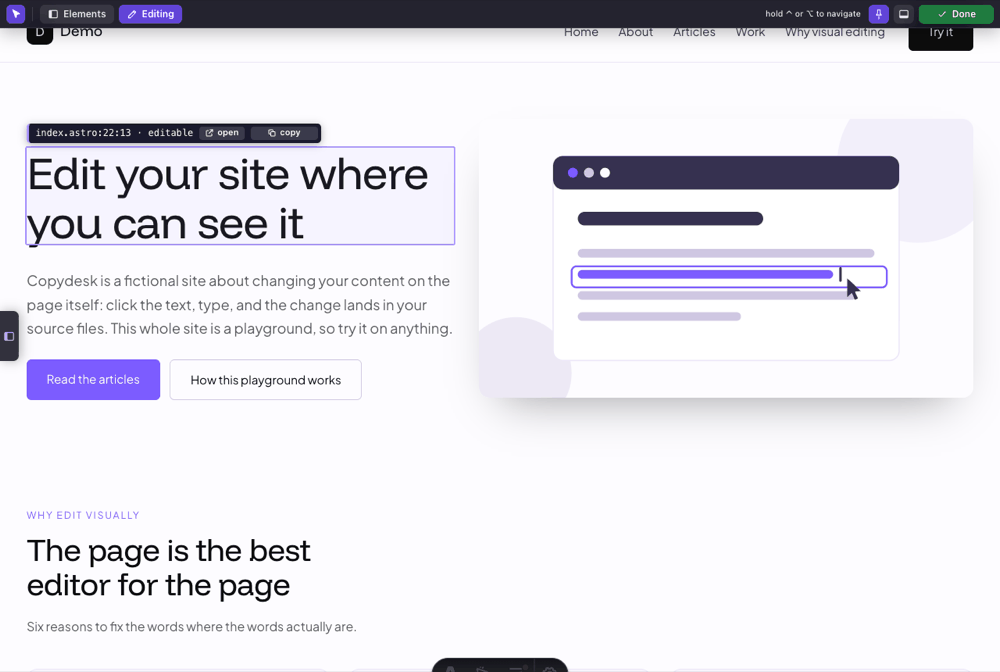
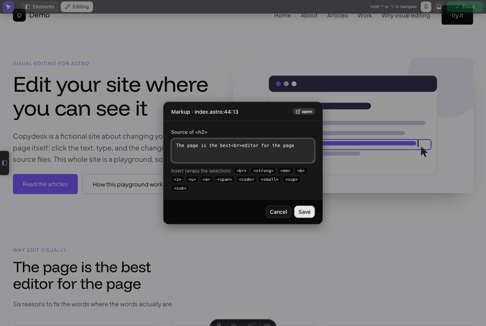
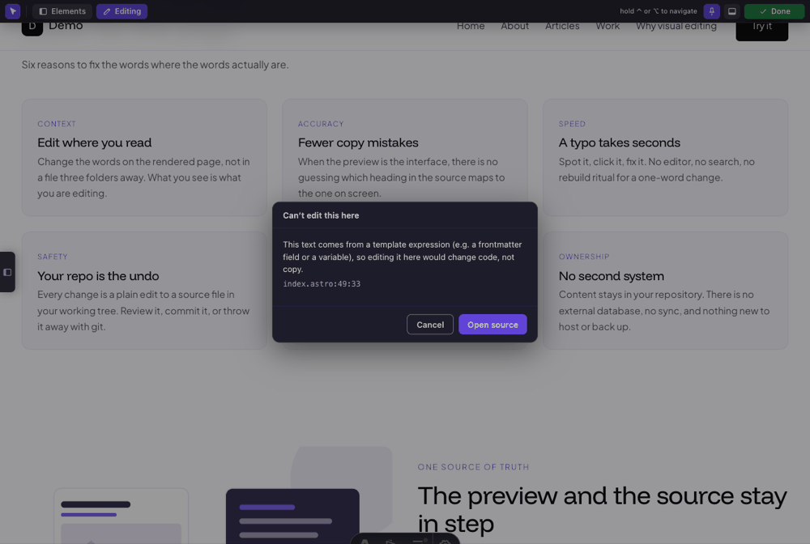
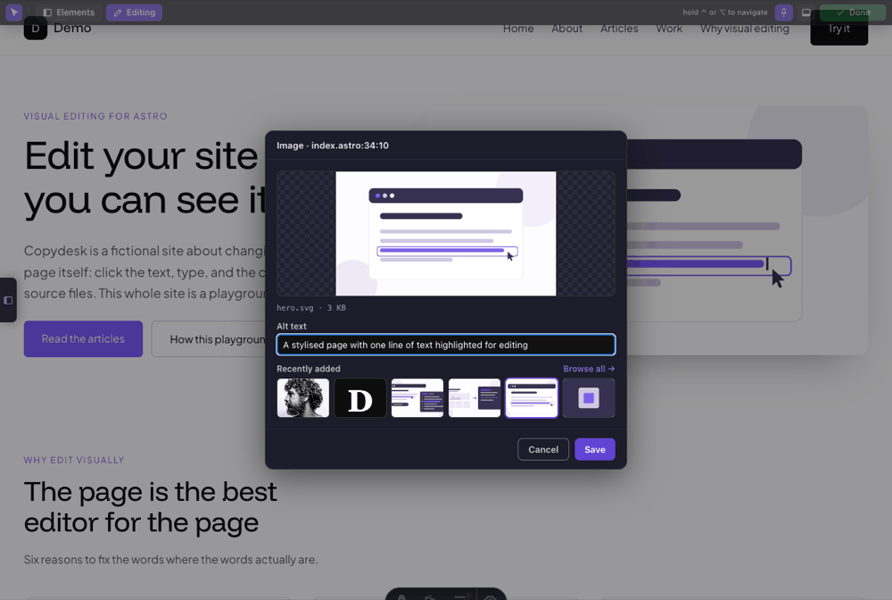
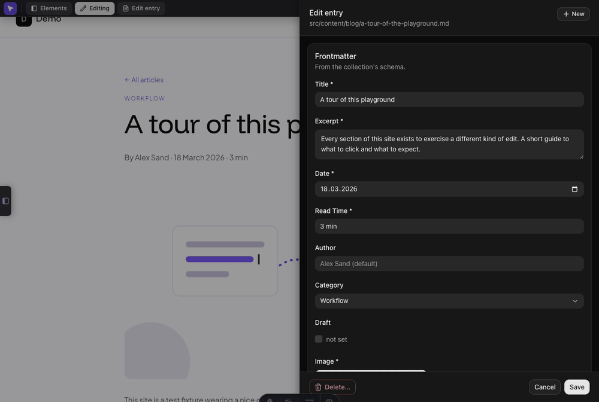
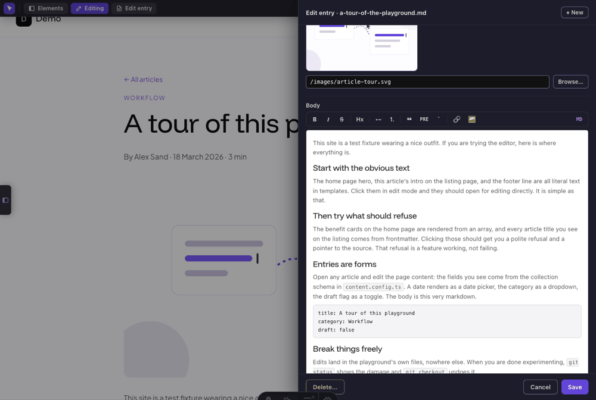
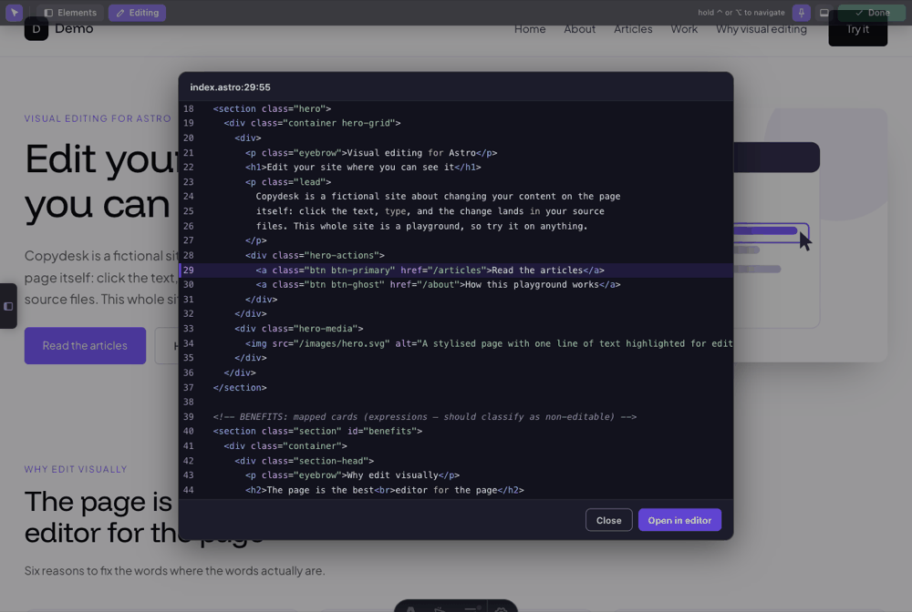
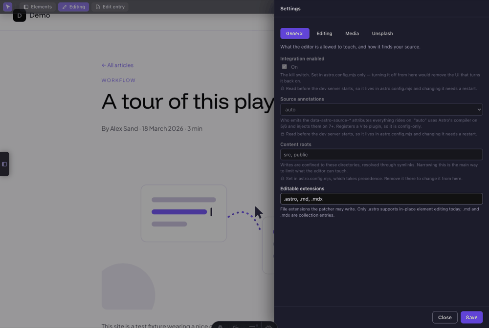

# astro-dev-edit

In-browser visual content editing for the Astro **dev server**. Turn on edit mode, click text or an image in the rendered page, and the change is written straight to the source file. Astro's HMR refreshes the preview. Hold **Ctrl** (**⌥ Option** on macOS) and a click on links navigates as usual, so you can move around the site without leaving edit mode.

**Development-focused by design.** The integration registers nothing for `astro build` / `astro preview`, so it can never reach a production bundle. It ships TypeScript source, and your Astro project compiles it like any other `.ts`.

[https://github.com/user-attachments/assets/ac4a1864-daec-4ab6-b7e5-5ee0839f5356](https://github.com/user-attachments/assets/ac4a1864-daec-4ab6-b7e5-5ee0839f5356)

## Install

```bash
npm install --save-dev "github:janjcwebtech/astro-dev-edit"
```

```js
// astro.config.mjs
import { defineConfig } from "astro/config";
import devEdit from "astro-dev-edit";

export default defineConfig({
  integrations: [devEdit()],
});
```

Run `npm run dev` and click **Edit page** in the admin bar across the top of the page.

**Astro 5.x to 7.x.** Everything rides on the `data-astro-source-*` attributes Astro puts on elements in dev. Astro 5 and 6 emit them from the compiler, but only while the dev toolbar is enabled, so keep `devToolbar.enabled` on or set `sourceAnnotations: 'force'`. From Astro 7 the Rust compiler doesn't emit them ([withastro/compiler-rs#96](https://github.com/withastro/compiler-rs/issues/96)), so the integration injects them itself and there is nothing to configure.

## What it does

- **Text, edited in place.** Click a literal string in an `.astro` template and type. The pill above it names the file and line the change will land in. Hit enter to save, escape to cancel.

  

- **Text carrying inline markup.** A heading broken by a `<br>`, or a sentence with a `<strong>` in it, opens a popup over the element's raw source, with a safelist of inline tags to insert. Text that comes from frontmatter, like `{expression}`, is traced back to the string that produced it.

  

- **If something is not editable with the tool, it points you to the source.** For components, `set:html`, block-level nested markup, expressions that can't be traced and anything rendered by a package, you get a notice explaining why, plus a jump to the source, rather than a write the tool can't prove is correct.

  

- **Images.** Click an image to swap its `src` and edit its `alt`, with a preview and the six most recently added images to hand.

  

- **Unsplash integration.** Insert your Unsplash API key to import images directly from Unsplash.

  

- **Content-collection entries editing.** **Edit entry** opens a drawer of typed fields generated from your own zod schema. A save is validated against the schema and etag-guarded against a lost update, and it is surgical: comments, key order and quoting survive byte-for-byte. You can create and delete entries here too.

  

- **The markdown body as rich text.** The same drawer edits the body either in a WYSIWYG editor (headings, emphasis, lists, quotes, code, links, images) or as raw markdown, whichever you prefer.

  

- **Collection schemas.** A designer lists every collection you declare and edits its fields: adding, retyping and removing them patches your `content.config.ts` directly. Each field says which half of it is schema (your committed source) and which is editor-only.

  

  Both drawers need one opt-in: a dev-only `<meta name="astro-dev-edit:page-source">` tag naming the file that backs the page. See [Entry editor and collection designer](docs/ENTRY-EDITOR.md).

- **Markup and CSS source peek.** The hover pill's location opens a syntax-highlighted peek of the file around the element, and **Open in editor** jumps to the exact line. An element tree lists everything annotated on the page, and the pill's class chips show which CSS rules apply and where they are written.

  

- **Settings, without a restart.** Every option below is editable from a Settings drawer, which stores your choices in `.astro-dev-edit.json` and applies them to the next request. Options you set in `astro.config.mjs` render read-only there, with a note saying where the value came from.

  

## Options

All are optional. Pass what you want to `devEdit({ … })`, or set it from the Settings drawer.

| Option             | Default                   | What it does                                                                                      |
| ------------------ | ------------------------- | ------------------------------------------------------------------------------------------------- |
| enabled            | true                      | Kill switch. Config-only — read before the dev server exists.                                     |
| assetDirs          | ['src/assets', 'public']  | Dirs the image picker scans.                                                                      |
| uploadDir          | 'public'                  | Where uploads land. Must be web-servable.                                                         |
| imageUploadDir     | 'src/assets'              | Fallback for uploads backing an image() field. Must be under src/.                                |
| editableExtensions | ['.astro', '.md', '.mdx'] | Extensions the patcher may write.                                                                 |
| contentRoots       | ['src', 'public']         | Writes are confined to these, symlinks resolved.                                                  |
| openInEditor       | true                      | The "Open source" / jump-to-file buttons.                                                         |
| cssInspector       | true                      | The hover pill's class/ID CSS inspector.                                                          |
| sourceAnnotations  | 'auto'                    | Who emits data-astro-source-\*: 'auto', 'force', 'off'. Config-only — it registers a Vite plugin. |
| entryEditor        | {}                        | The entry drawer; false disables it.                                                              |
| schemaEditor       | true                      | Whether the designer may write your content.config.ts.                                            |
| unsplash           | false                     | The Unsplash source; {} turns it on. Sub-options: accessKey, appName, perPage, importWidth.       |

Precedence, highest first: **`astro.config.mjs` → `.astro-dev-edit.json` → the defaults above.** `astro.config.mjs` wins because it is code you wrote deliberately, it is committed, and `astro build` reads it. The two config-only options are consumed before a dev server exists, so they can come only from that file. `.astro-dev-edit.json` **should be gitignored**, because it also holds your Unsplash access key, and the drawer warns when it isn't.

### Save your work with git

**Every save writes the source file on disk immediately.** There is no undo button and no history at the moment: the safety model is your **git working tree**. Start an editing session from a clean tree so `git diff` shows exactly what changed, and revert with `git checkout <file>`. Writes are atomic (temp file + rename) and verified first: the server confirms the source still matches what the page showed, so a stale click fails safe instead of corrupting the file. Treat it like editing the files directly, because that is what it does.

## Limits

- **Dev and localhost only.** Nothing runs in build or preview, and every endpoint rejects non-localhost requests.
- **Content, never structure.** Inline-edited text is escaped so it cannot introduce a tag, an expression or an entity. The markup popup lets tags through, but only the inline safelist, only with presentational attributes, and only well-nested.
- **The rich body editor covers a markdown subset**: headings, emphasis, lists, quotes, code, links, images, hr. Anything past it (tables, raw HTML/MDX, footnotes, nested lists) stays editable as markdown source.
- **The collection designer reads only the schema shapes it can prove**: `schema: z.object({ … })` and `schema: ({ image }) => z.object({ … })` with a plain field list. It reports anything else as unreadable and offers _Open source_ instead.
- **Unsplash is free-tier only**, and a photo is importable only while the dev server that searched for it is still running.

### Documentation (Maintained by agent)

| Doc                                  | What's in it                                                |
| ------------------------------------ | ----------------------------------------------------------- |
| Editing reference                    | Everything the overlay can edit, and every surface it draws |
| Entry editor and collection designer | The CMS drawer, the meta tag, schema editing                |
| Media picker and Unsplash            | Choosing, uploading and importing images                    |
| Styling reference                    | The atx-\* hooks and how to override them                   |
| Changelog                            | What changed, release by release                            |

## Credits

The technique of snapshotting Astro's `data-astro-source-*` attributes into a private JS property the instant they appear, before the dev-toolbar runtime strips them from the live DOM, is borrowed from [`astro-click-to-source`](https://www.npmjs.com/package/astro-click-to-source) by **invisible1988** (MIT). Thanks to that project for the approach.

## License

MIT
