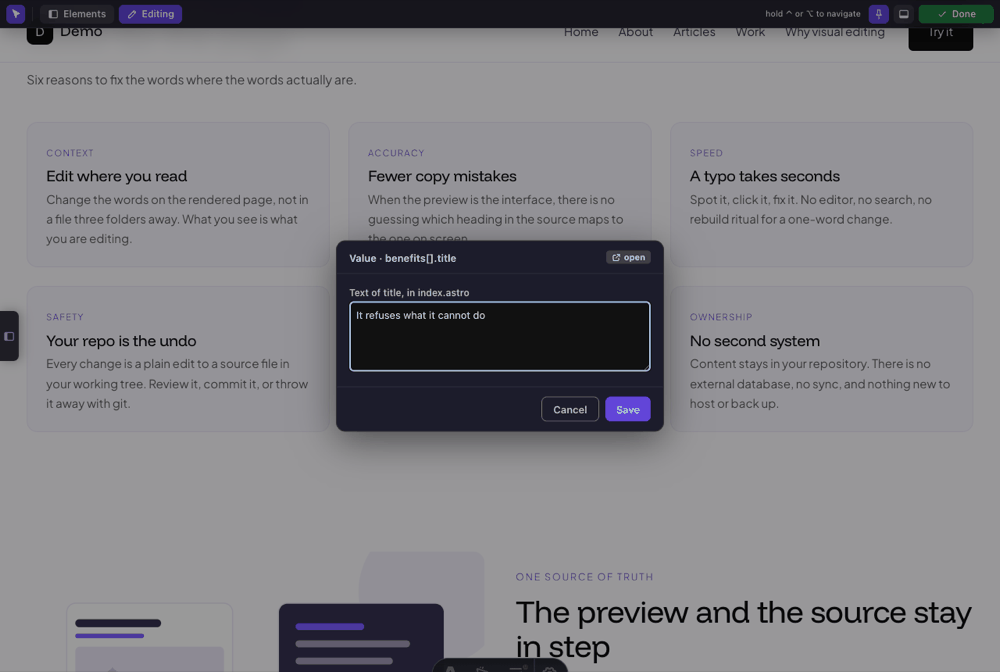
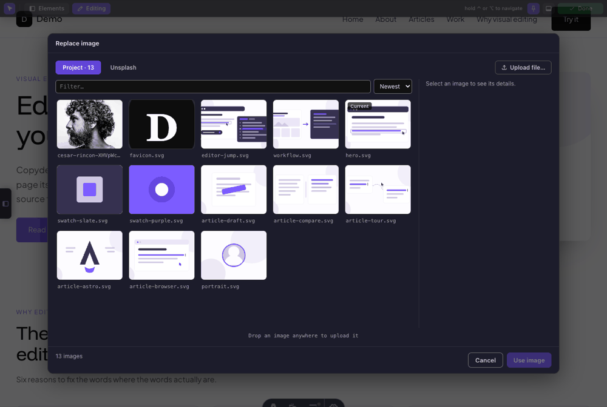

# astro-dev-edit

In-browser visual content editing for the Astro **dev server**. Turn on edit
mode, click text or an image in the rendered page, and the change is written
straight to the source file — Astro's HMR refreshes the preview. Hold **Ctrl**
(or **⌥ Option** on macOS) and clicks navigate normally, so you can move
around the site without leaving edit mode.

**Development-focused by design.** The integration registers nothing for
`astro build` / `astro preview`, so it can never reach a production bundle. It
ships TypeScript source; your Astro project compiles it like any other `.ts`.


https://github.com/user-attachments/assets/ac4a1864-daec-4ab6-b7e5-5ee0839f5356


## Install

```bash
npm install --save-dev "github:janjcwebtech/astro-dev-edit"
```

```js
// astro.config.mjs
import { defineConfig } from 'astro/config';
import devEdit from 'astro-dev-edit';

export default defineConfig({
  integrations: [devEdit()],
});
```

Run `npm run dev` and click **Edit page** in the admin bar across the top of
the page.

**Astro 5.x–7.x.** Everything rides on the `data-astro-source-*` attributes
Astro puts on elements in dev. On **5/6** Astro's compiler emits them, but only
while the **dev toolbar is enabled** — keep `devToolbar.enabled` on, or set
`sourceAnnotations: 'force'`. On **≥7** the Rust compiler doesn't emit them
([withastro/compiler-rs#96](https://github.com/withastro/compiler-rs/issues/96)),
so the integration injects them itself and there is nothing to configure.

## What it does

-   **Text, edited in place.** Click a literal string in an `.astro` template
    and type. The pill above it names the file and line the change will land
    in. Enter saves, Escape cancels.

    

-   **Text carrying inline markup.** A heading broken by a `<br>`, a sentence
    with a `<strong>` in it — these open a popup over the element's raw source,
    with a safelist of inline tags to insert.

    

-   **Text that comes from frontmatter.** A `{expression}` — a const, or one
    item of an array a `.map()` loops over — is traced back to the string that
    produced it. The edit goes to the frontmatter; the template is never
    touched.

    

-   **A refusal, never a guess.** Components, `set:html`, block-level nested
    markup, expressions that can't be traced, anything rendered by a package —
    all of it declines with a reason and a jump to the source, rather than
    writing something it can't prove.

    

-   **Images and alt text.** Click an image to swap its `src` and edit its
    `alt`, with a preview and the six most recently added images to hand.

    

-   **A picker over your own images.** Browse everything under `assetDirs`
    newest-first, filter it, read a file's details, or drop a file anywhere on
    the modal to upload it. Picking is staged — Cancel or Escape writes
    nothing at all.

    

-   **Unsplash, if you want it.** Off until you turn it on with your own access
    key. Search from inside the overlay and the dev server downloads the photo
    into your project at the width you pick; only the local path is written to
    your source, so your published site never depends on Unsplash being up.

    

-   **Content-collection entries as a form.** On a page that names its backing
    entry file, **Edit entry** opens a drawer of typed fields generated from
    your own zod schema. Saves are surgical — comments, key order and quoting
    survive byte-for-byte — validated against the schema, and etag-guarded
    against a lost update. Entries can be created and deleted here too.

    

-   **The markdown body as rich text.** The same drawer edits the body in a
    WYSIWYG editor — headings, emphasis, lists, quotes, code, links, images —
    or as raw markdown, whichever you prefer.

    

-   **Collection schemas.** A designer lists every collection you declare and
    edits its fields: adding, retyping and removing them patches your
    `content.config.ts` directly. Each field says which half of it is schema
    (your committed source) and which is editor-only.

    

    Both drawers need one opt-in: a dev-only
    `<meta name="astro-dev-edit:page-source">` tag naming the file that backs
    the page. See [Entry editor and collection designer](docs/ENTRY-EDITOR.md).

-   **The source, without leaving the page.** The hover pill's location opens a
    syntax-highlighted peek of the file around the element, and **Open in
    editor** jumps to the exact line. An element tree lists everything
    annotated on the page, and the pill's class chips show which CSS rules
    apply and where they are written.

    

-   **Settings, without a restart.** Every option below is editable from a
    Settings drawer, which stores your choices in `.astro-dev-edit.json` and
    applies them to the next request. Options you set in `astro.config.mjs`
    render read-only there, with a note saying where the value came from.

    

## Options

All optional — pass what you want to `devEdit({ … })`, or set it from the
Settings drawer.

| Option | Default | What it does |
| --- | --- | --- |
| `enabled` | `true` | Kill switch. **Config-only** — read before the dev server exists. |
| `assetDirs` | `['src/assets', 'public']` | Dirs the image picker scans. |
| `uploadDir` | `'public'` | Where uploads land. Must be web-servable. |
| `imageUploadDir` | `'src/assets'` | Fallback for uploads backing an `image()` field. Must be under `src/`. |
| `editableExtensions` | `['.astro', '.md', '.mdx']` | Extensions the patcher may write. |
| `contentRoots` | `['src', 'public']` | Writes are confined to these, symlinks resolved. |
| `openInEditor` | `true` | The "Open source" / jump-to-file buttons. |
| `cssInspector` | `true` | The hover pill's class/ID CSS inspector. |
| `sourceAnnotations` | `'auto'` | Who emits `data-astro-source-*`: `'auto'`, `'force'`, `'off'`. **Config-only** — it registers a Vite plugin. |
| `entryEditor` | `{}` | The [entry drawer](docs/ENTRY-EDITOR.md); `false` disables it. |
| `schemaEditor` | `true` | Whether the designer may write your `content.config.ts`. |
| `unsplash` | `false` | The [Unsplash source](docs/MEDIA.md#unsplash-photo-picker); `{}` turns it on. Sub-options: `accessKey`, `appName`, `perPage`, `importWidth`. |

Precedence, highest first: **`astro.config.mjs` → `.astro-dev-edit.json` → the
defaults above.** `astro.config.mjs` wins because it is code you wrote
deliberately, it is committed, and `astro build` reads it. The two config-only
options are consumed before a dev server exists, so they can come only from
that file. `.astro-dev-edit.json` **should be gitignored** — it also holds your
Unsplash access key, and the drawer warns when it isn't.

Three things about saving from the drawer:

- **Changes bite on the very next request**, including the ones that *restrict*
  the editor — narrowing `contentRoots` takes effect immediately.
- **A save is all-or-nothing.** If any option in the patch is unknown,
  config-only, locked or the wrong shape, the whole save is refused with a
  message against each offending control, and nothing is written.
- **Switching a feature off keeps its configuration**, so turning it back on
  restores the widget overrides and app name you had.

## Undo is git

**Every save writes the source file on disk immediately.** There is no undo
button and no history — the safety model is your **git working tree**. Start
an editing session from a clean tree so `git diff` shows exactly what changed,
and revert with `git checkout <file>`. Writes are atomic (temp file + rename)
and verified first: the server confirms the source still matches what the page
showed, so a stale click fails safe rather than corrupting the file. Treat it
like editing the files directly, because that is what it does.

## Limits

- **Dev and localhost only.** Nothing runs in build or preview, and every
  endpoint rejects non-localhost requests.
- **Content, never structure.** Inline-edited text is escaped so it cannot
  introduce a tag, an expression or an entity. The markup popup lets tags
  through, but only the inline safelist, only with presentational attributes,
  and only well-nested.
- **The rich body editor covers a markdown subset** — headings, emphasis,
  lists, quotes, code, links, images, hr. Anything past it (tables, raw
  HTML/MDX, footnotes, nested lists) stays editable as markdown source.
- **The collection designer reads only the schema shapes it can prove** —
  `schema: z.object({ … })` and `schema: ({ image }) => z.object({ … })` with a
  plain field list. Anything else is reported unreadable and offers *Open
  source*.
- **Unsplash is free-tier only**, and a photo is importable only while the dev
  server that searched for it is still running.

## How it works

Astro's `data-astro-source-*` attributes are stripped from the live DOM shortly
after hydration, so a `MutationObserver` snapshots each element's location into
a private JS property the instant it appears. On click, the client asks the dev
server to classify the target from the **`.astro` source AST** — the DOM cannot
tell a resolved `{expression}` from literal text — and only what the AST proves
editable is offered. Saves POST to a localhost-only endpoint that re-resolves
the element, verifies the source still matches, and writes atomically. Which
file backs the whole *page* is a separate question, answered from Astro's route
manifest rather than from the DOM.

## Documentation

| Doc | What's in it |
| --- | --- |
| [Editing reference](docs/EDITING.md) | Everything the overlay can edit, and every surface it draws |
| [Entry editor and collection designer](docs/ENTRY-EDITOR.md) | The CMS drawer, the meta tag, schema editing |
| [Media picker and Unsplash](docs/MEDIA.md) | Choosing, uploading and importing images |
| [Styling reference](docs/STYLING.md) | The `atx-*` hooks and how to override them |
| [Changelog](CHANGELOG.md) | What changed, release by release |

## Credits

The technique of snapshotting Astro's `data-astro-source-*` attributes into a
private JS property the instant they appear — before the dev-toolbar runtime
strips them from the live DOM — is borrowed from
[`astro-click-to-source`](https://www.npmjs.com/package/astro-click-to-source)
by **invisible1988** (MIT). Thanks to that project for the approach.

## License

MIT
