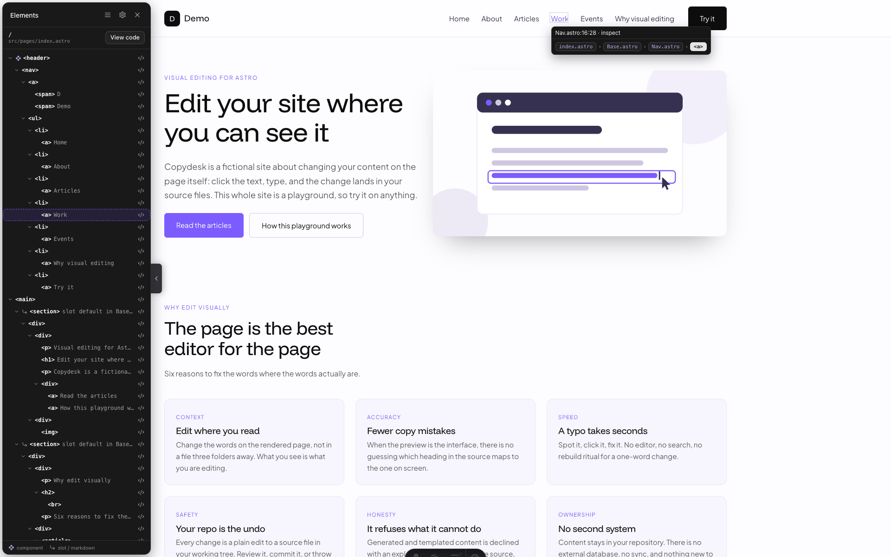

# Editing reference

What the overlay can and can't edit, and every surface it puts on the page.
The [README](../README.md) has the short version; this is the whole of it.

- [What it can edit](#what-it-can-edit)
- [Staged values and Save](#staged-values-and-save)
- [The hover pill and View code](#the-hover-pill-and-view-code)
- [Copy context for an AI assistant](#copy-context-for-an-ai-assistant)
- [CSS](#css)
- [The panels](#the-panels)
- [Element tree](#element-tree)

## What it can edit

| Click on | What opens | What is written |
| --- | --- | --- |
| Literal text in an `.astro` template | inline edit — Enter or blur saves, Esc cancels | the element's text |
| Text carrying inline markup | a **markup popup** | the element's source |
| Text rendered through an `{expression}` | a **value popup** | the string in the frontmatter |
| A prop or slot value at a component usage site † | a **Values** row with a field | the attribute, the frontmatter string, or the slot text — in the caller's file |
| A static `` † | the inspector's **image picker**, above its `src` and `alt` rows | `src` and `alt` |
| A route rendering a `.md`/`.mdx` entry † | a Values row naming that file, with **View code** and no field | nothing |
| Anything else | a notice with the reason and a *View code* jump | nothing |

† Inspector surfaces. Without them
an image click is refused in words — `src` and `alt` are edited in the file
instead — and there are no Values rows at all. See
[Component tracing and inspector](COMPOSITION-API.md).

### Inline markup

A heading broken by a ` `, or a sentence carrying a `<strong>` or a link. Inline editing cannot serve these — it escapes `<`, which would turn the tag into visible punctuation — so a click opens a popup on the element's source instead.

- **Save** with the button or Cmd/Ctrl+Enter. **open** in the title bar jumps to the file without closing the popup.
- **Allowed tags:** `<a> <b>   <code> <em> <i> <small>  <strong>   <u>`, with the presentational attributes `class`, `id`, `title`, `lang`, `dir`, plus `href`, `target` and `rel` on links. Attributes already in your source are kept as they are.
- **Anything else is refused rather than written**, unbalanced tags included. The refusal shows *in the popup*, which stays open with your markup intact.
- **Each allowed tag is a button** under the box. With text selected it wraps the selection and keeps it selected, so tags stack; otherwise it drops an empty pair at the caret. ` ` inserts alone, and `<a>` arrives as `<a href="">` with the caret inside the quotes.

### Expressions

A frontmatter const (`<h1>{title}</h1>`), or one item of an array a `.map()` loops over (`{benefits.map((b) => <h3>{b.title}</h3>)}`). The popup is titled with where the string lives (`benefits[].title`), and the edit is written to that string — the template itself is never touched.

- **Plain text only.** `{value}` renders escaped, so a tag typed here shows as punctuation.
- **Which loop item you clicked is identified by the text on the page** — every card shares one source location, so the item whose value equals what you saw is the one patched.
- **Refused rather than guessed:** two items reading exactly the same way, computed expressions (`{n + 1}`), template literals containing `${…}`, `.filter().map()` chains, nested access (`{b.meta.label}`), and arrays imported from another file.

### Images

`src` and `alt` are Values rows with fields of their own, and above them sits the image picker — thumbnails of the project's images, a filter, and an upload. **Picking stages the value; only Save writes it.** Only statically-quoted attributes are editable — `src={…}` and `<Image>` are treated as dynamic — and an `alt` the source does not contain is named rather than inserted. [MEDIA.md](MEDIA.md) has the whole of it.

### Markdown-backed content

Content that lives in a `.md` or `.mdx` entry is **not** edited in the browser. It gets a Values row like everything else, carrying **View code** onto the entry file and no field at all — so a frontmatter key and a body line are navigated to, never written for you.

**One row per value, not one per page.** Two shapes reach it, and they are proven to different depths:

- **Body content** — a paragraph, heading or list item from `<Content />`. The Markdown renderer is not an `.astro` component, so nothing it emits carries a source annotation; what identifies it is that the route's own template is the nearest annotated thing above it. *View code* opens the entry **at its top**: no line is invented for a rendered paragraph.
- **A frontmatter value** — `{entry.data.title}` written in the route template. That it reads the entry is **inferred**, not proven, and the row says so: the expression is a member access the tracer does not model, so what is known is the route, its template, and the entry the page declared.

**The page declares its backing file**, with `<meta name="astro-dev-edit:page-source" content="src/content/…/x.md">`. Nothing is derived from the URL.

**When no backing file is declared**, nothing is invented: the value keeps the template's own refusal, and the jump lands on the **route template** — the enclosing element that does have a source, or the file the route is written in. An entry path is never guessed from a slug.

Literal content written in the Astro route template stays editable as usual, so one page shows both behaviours. The component chain of a Markdown-backed value ends at **Content — markdown, chain ends**, marked *inferred* with its reason.

### What refuses, and why

Every refusal names its reason and offers one *View code* jump — a read-only source popup carrying its own **Open in editor**. On a route that declares a Markdown backing file, a value coming from that entry is not a refusal at all: it is an `elsewhere` row naming the file (above).

- **Not traceable to a string** — an expression the AST cannot resolve, a component, a `set:html` whose value is not a quoted string or a frontmatter `const`, or block-level nested markup.
- **Arriving as a prop** — the component was handed these words by whoever used it, so the strings are in *that* file's frontmatter. The notice names the prop rather than calling the copy code, because a `const faqs = [{ question: "Is it free?" }]` one file away is plain copy the tool would edit without hesitation if it were declared where it is rendered. Which file that is depends on the call site, so the notice points rather than writes; the **Component chain** names the usage site and the value is editable there.
- **Rendered by a component or a slot** — it has no source location of its own, because Astro annotates only what is written in the file, so the click is answered about the nearest element that *has* one. The notice names the tag you clicked, since the reason belongs to that ancestor: a one-word button can be refused for "containing nested markup" that lives in the wrapper around it.
- **Rendered by a package** — `astro:assets`' `<Image>` renders through `node_modules/astro/components/Image.astro`, and that is the path its annotation carries. The notice names where the component was *used* — the nearest enclosing element written in your own source — and its button opens that file at that line, so the jump lands on the call site rather than in Astro's internals. Two levels of indirection are fine: a wrapper of your own around an `<Image>` still resolves to the markup that holds it. It is a **jump, not an edit**: an `<Image>`'s `src` and `alt` reach it as props, which the patchers do not trace, so you change them in the file the button opens. Package paths are never writable, and never open in your editor either — `contentRoots` does not include `node_modules`, and widening it is not a supported fix. Asking to open one is refused with that sentence rather than an error.

## Staged values and Save

In the inspector, an edit is **staged**
before it is written. Every value the write path can serve gets a field in
**Values** and exactly one **Save** / **Revert** pair under that field. The page
and the field are two views of one value: type in either, save from either.

- **Nothing reaches a file until Save.** **Enter** or **Save** writes;
  **Esc** or **Revert** discards. Anything else — clicking another element,
  releasing ⌥, closing the panel — leaves the change pending and says so.
  Blur commits nothing.
- **The element wears an amber outline while it is pending**, inside the purple
  selection frame. The two are deliberately different colours: "this is what I
  picked" must never read as "this is on disk". The panel header carries the
  same answer as a `saved` / `N unsaved` chip on the status row.
- **Literal text is typed on the page.** Clicking text puts the caret where you
  clicked and mirrors what you type into the field — hold Alt, or leave the
  element tree open, which arms selection on a plain click. Everything else is
  typed in the field only — markup's value is the element's *source*, which a
  browser hands back re-spelled; an expression's words live in the frontmatter
  rather than in the text node; and a value passed at a usage site is rendered
  somewhere inside a component.
- **A prop or slot value is edited where it is written, not where it is read.**
  A quoted prop writes the attribute at the usage site, a traced prop writes
  the frontmatter string it reads, and literal slot text writes the caller's
  file — never the component's. The field holds the **words**: `title="…"`
  loses its quotes, and braces, angle brackets and quotes you type are encoded
  for wherever they are going, so they stay words.
- **A value inside a `.map()` writes the entry that render read.** Editing the
  second card moves the second array entry. That needs the chain to be proven;
  where it is not, the row reads *which array entry it reads is not yet
  proven* and has no field. The element the value was passed to wears the
  amber outline, so one card of a loop marks on its own.
- **A value is a source location, not an element.** A literal a layout renders
  on two routes is one value writing one line, so both elements go amber
  together and one Save covers them.
- **Prose over ~70 characters opens as a textarea.** Shift+Enter breaks the
  line, because Enter is Save.
- **Verify-then-patch is unchanged.** Save sends the text the page showed as
  the op's `original`; a source that has moved on is refused, the refusal shows
  in the row, and the value stays pending rather than being thrown away.
- **There is no in-app undo.** Past a Save the git tree is the way back.

### What happens when the source changes underneath

Astro answers an `.astro` change with a full page reload, so pending edits are
kept in `sessionStorage` and taken back on boot — but never blindly. Each one
has to still find its element, at its source location, reading the text it was
staged against.

- **An unrelated file changed** → the pending edit is restored, amber and all.
- **The value's own source changed** → it is dropped, with a toast naming the
  file and location, and **nothing is written**. Saving against source that
  moved is not one of the options.

Every `editable` verdict has a field: the literal-text targets — text, inline
markup, a traced expression — the whole HTML string a `set:html` holds, the
prop and slot values at a component usage site, and an image's `src` and `alt`.
The image picker is a second view of that `src` row rather than a second way to
write it: a tile click stages into the same store the field does. A row that is
`elsewhere` or `read-only` keeps its sentence and its **View code** and has no
field at all.

### A value the page renders as HTML

`set:html` names a value rather than structure, so it is judged like any other
one. `
` gets a row for the whole string, and so does
`set:html` passed at a usage site. The field is **raw**, never a structural
editor: angle brackets, braces and quotes are content, and nothing claims to
know what the elements the HTML produces correspond to — the elements inside it
keep saying they have no proven source.

Two destinations spell the value differently, and the difference is load-bearing:

- a **frontmatter `const`** takes it as written, escaping only the quote and
  the backslash the JavaScript literal needs;
- a **quoted attribute** takes it verbatim, because Astro injects that
  attribute's source text without decoding entities. So the field shows what
  the source spells — `&amp;`, not `&` — and a value containing the quote that
  would close the attribute is refused, since there is no entity that spells
  one there. Move it into a frontmatter `const` to use it.

The caret never goes on the page for one: its tags would become the elements
they describe.

## The hover pill and View code

Hovering an element draws a box a couple of pixels clear of it and shows a
`file:line:col · inspect` pill above. It is a pointer, not a verdict: it claims
nothing about what a click will do and costs no request.

Rest on one element and the pill grows a second row — the breadcrumb of files
responsible for what you are pointing at, `index.astro › Services.astro ›
ServiceCard.astro › <h2>`, ending in the element itself. Each file is a button:
it opens the inspector on the element you are hovering, scrolled to that link's
row in the **Component chain**, so a segment is a way into the panel rather
than a different selection. A segment the chain could not resolve is drawn
dashed and does nothing. Ids resolve in one batched request per page, not one
per hover.

**View code** — on the tree header, on a Values row, on a slot row — shows the
file syntax-highlighted with line numbers, scrolled to the element's line. Where
it opens depends on the layout: the **code dock** when the panels are docked, a
wide read-only modal when they are floating. Either way its **Open in editor**
jumps to that location in your real editor.

That same jump-out can also run on every save: *Settings → Editing* has
**Show changed files in editor**, which opens each file the tool writes at the
line it is about to change, so an edit can be watched landing in the source. See
[Watching writes in your editor](CONFIGURATION.md#watching-writes-in-your-editor).

## Copy context for an AI assistant

The inspector's header has a **Copy context** button, and the tree's menu has
**Copy page context** for the route as a whole. The element one puts on your
clipboard what an assistant needs to find that element in your source, as one
markdown block to paste along with what you want changed:

- a heading naming the element and the first 80 characters of its **text**;
- its **source location**, repo-relative (`src/components/Hero.astro:12:3`);
- the files that **render** it, outermost first — each component's usage site
  (`file:line:col`) and name;
- the page's **content entry** when it declares one;
- where its **text** comes from: written literally on the quoted line, traced
  to a frontmatter string, passed in as a prop by the caller named above, or
  computed — in which case the words are not in this file;
- the element's own **source lines**, from its opening line to its closing tag,
  read through the same `/peek` endpoint *View code* uses. A location the server
  won't serve (an `astro:assets` `<Image>`, say) says so instead, and the
  element's **opening tag** and **DOM path** take the quote's place.

Rendered HTML and applied CSS are left out on purpose: compiled markup exists
in no source file, so an assistant handed it searches for markup that is not
there. Use *View code* for the surrounding file and the CSS card for the rules.

If your browser refuses clipboard access — reaching the dev server over a
network address is not a secure context, so the API is simply absent — the copy
reports that it could not write to the clipboard. There is no hand-copy
fallback panel.

## CSS

The inspector's **CSS** card lists every rule the element actually matches, in
stylesheet order, read straight from the browser so it needs no server
round-trip. Each rule whose source can be resolved offers an **open** that jumps
your editor to (near) the rule; rules from cross-origin/CDN stylesheets or an
inline `<style>` are shown without one. A **Computed styles** disclosure below
gives the resolved values, inheritance included.

Conditional rules — inside a media or container query that does not currently
apply — are listed too, because "why is this not taking effect" is the question
the card exists to answer.

Turn the whole card off with `cssInspector: false`; it then says so rather than
disappearing.

## The panels

There is no bar across the top. Everything lives in three panels, and on a page
you have not asked anything of, none of them is drawn — only a small tab on the
left edge.

**Element tree**, left. Its header carries the route and the file it is written
in, a **View code** button for that file, and two icon buttons:

- **Menu** — *Copy page context* (this route, its source file and the components
  on it, as markdown) and *Re-scan the page* (re-read the annotations and rebuild
  the tree). Its foot reports the dev-server connection.
- **Settings** — the drawer where [every integration option](CONFIGURATION.md)
  is editable.

**Inspector**, right. Its header names the selected tag and holds **Copy
context** plus the layout switch. A `proven chain` badge says how sure the
tracing is about what rendered the element.

**Code dock**, bottom. It names the open file and line, offers **Open in
editor**, and follows the selection: pick another element and the dock moves to
that element's own source. Its top edge is a drag handle — double-click resets
the height — and the chevron folds it away.

### Docked or floating

The button in the inspector's header switches between the two:

- **Docked** — the page is reflowed *between* the panels, so nothing of your
  site is covered. This is what the padding on `<html>` is doing.
- **Floating** — the panels sit over the page, which is what a viewport too
  narrow to dock falls back to.

The choice is remembered per browser.

**Panels and drawers are modal.** While one is open, the keyboard stays in it:
Tab cycles through its own controls and wraps, the page behind it is out of
reach, Escape closes it, and focus returns to whatever you were on when it
opened. Each announces itself as a dialog, named by its title.

## Element tree

A **tree of the page's elements** — every source-annotated element, nested by
structure — sits on the left. It opens from the tab on the left edge and closes
with its ✕, leaving that tab behind. It is two-way linked to the page: hovering
a row outlines the matching element, and hovering an element on the page
highlights its row and scrolls the tree to it.

- **Click a row** to select the element. The inspector and the code dock both
  follow that selection; it clears on **Escape**, a click elsewhere on the page,
  or another row.
- **Click a row's `</>`** to open that file at that line in your editor — the
  same `/open` every other source surface uses. Hovering it names the file, line
  and column.
- Component and slot boundaries are marked, and the legend at the foot says
  which mark is which.
- The tree collapses per node and rebuilds after each save, preserving collapse
  and selection by their stable paths.
- Whether it was open is remembered for the session, so a save-triggered reload
  restores it the way you left it.

Selecting on the page without the tree open needs a modifier: hold **Alt/Option**
and click. While the tree is open, selection needs no key.
