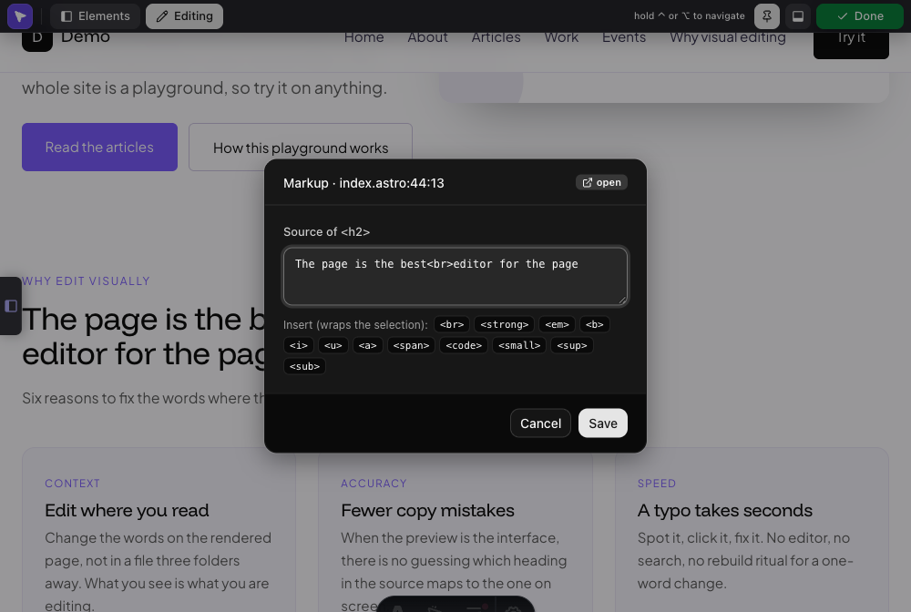
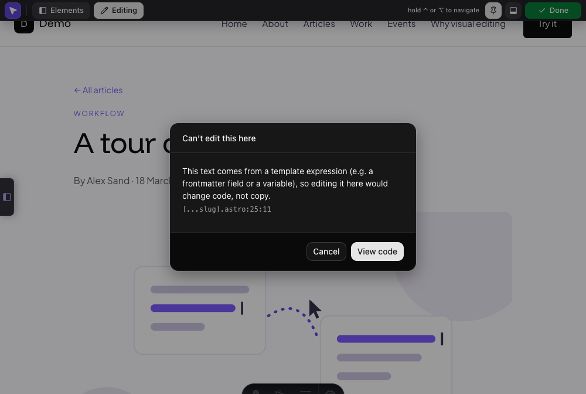
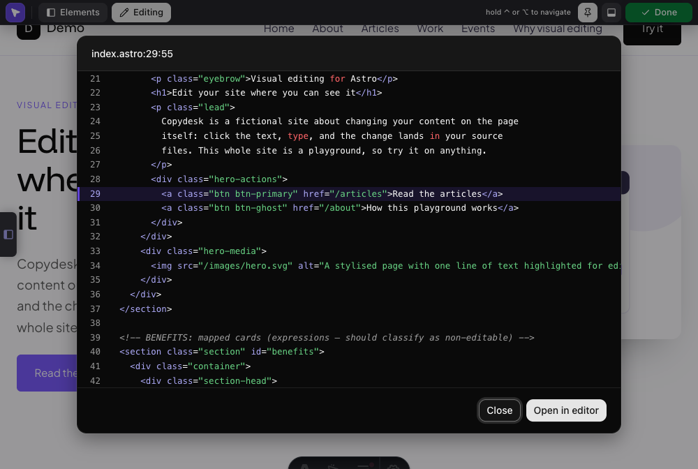
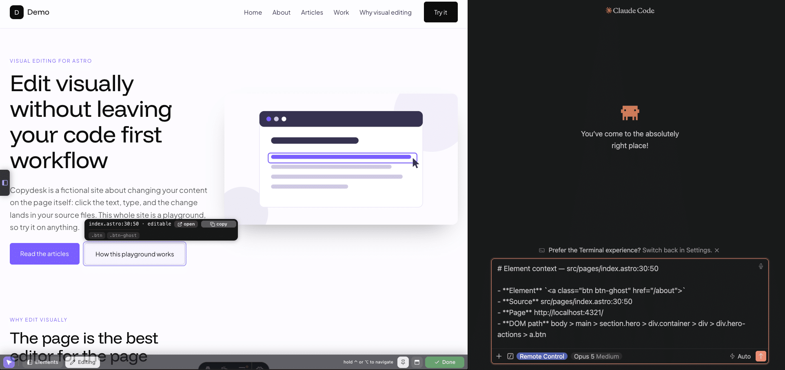
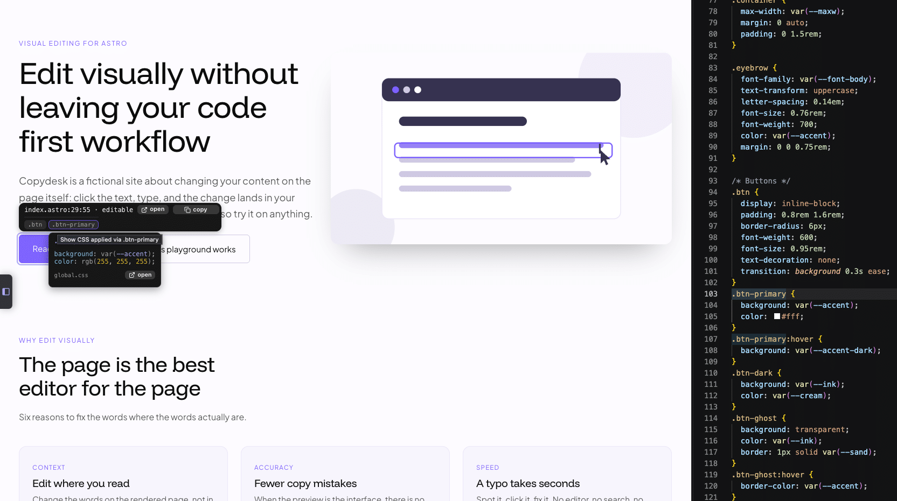
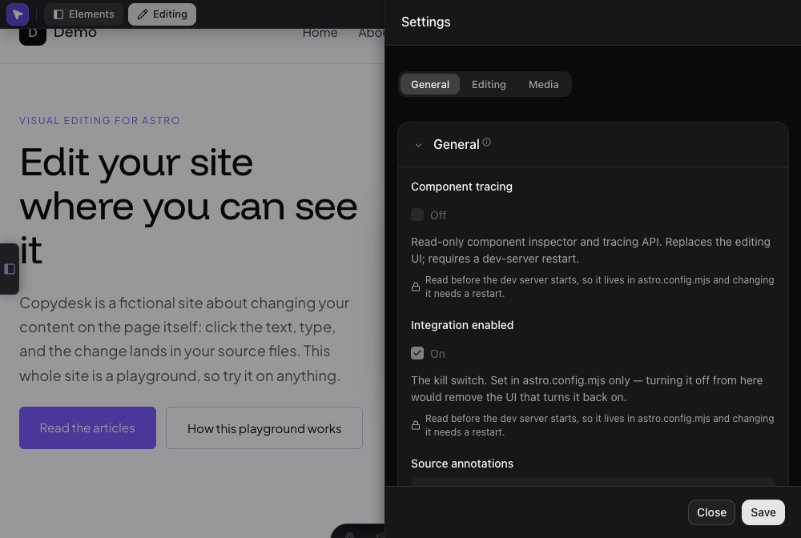

# Editing reference

What the overlay can and can't edit, and every surface it puts on the page.
The [README](../README.md) has the short version; this is the whole of it.

- [What it can edit](#what-it-can-edit)
- [Staged values and Save](#staged-values-and-save)
- [The hover pill and source peek](#the-hover-pill-and-source-peek)
- [Copy context for an AI assistant](#copy-context-for-an-ai-assistant)
- [CSS inspector](#css-inspector)
- [The admin bar](#the-admin-bar)
- [Element tree](#element-tree)

## What it can edit

| Click on | What opens | What is written |
| --- | --- | --- |
| Literal text in an `.astro` template | inline edit — Enter or blur saves, Esc cancels | the element's text |
| Text carrying inline markup | a **markup popup** | the element's source |
| Text rendered through an `{expression}` | a **value popup** | the string in the frontmatter |
| A prop or slot value at a component usage site | a **Values** row with a field | the attribute, the frontmatter string, or the slot text — in the caller's file |
| A static `` | the **image panel** | `src` and `alt` |
| A page declaring a backing `.md`/`.mdx` | a notice naming that file, to open in your IDE | nothing |
| Anything else | a notice with the reason and a *View code* jump | nothing |

### Inline markup

A heading broken by a ` `, or a sentence carrying a `<strong>` or a link. Inline editing cannot serve these — it escapes `<`, which would turn the tag into visible punctuation — so a click opens a popup on the element's source instead.

- **Save** with the button or Cmd/Ctrl+Enter. **open** in the title bar jumps to the file without closing the popup.
- **Allowed tags:** `<a> <b>   <code> <em> <i> <small>  <strong>   <u>`, with the presentational attributes `class`, `id`, `title`, `lang`, `dir`, plus `href`, `target` and `rel` on links. Attributes already in your source are kept as they are.
- **Anything else is refused rather than written**, unbalanced tags included. The refusal shows *in the popup*, which stays open with your markup intact.
- **Each allowed tag is a button** under the box. With text selected it wraps the selection and keeps it selected, so tags stack; otherwise it drops an empty pair at the caret. ` ` inserts alone, and `<a>` arrives as `<a href="">` with the caret inside the quotes.

### Expressions

A frontmatter const (`<h1>{title}</h1>`), or one item of an array a `.map()` loops over (`{benefits.map((b) => <h3>{b.title}</h3>)}`). The popup is titled with where the string lives (`benefits[].title`), and the edit is written to that string — the template itself is never touched.

- **Plain text only.** `{value}` renders escaped, so a tag typed here shows as punctuation.
- **Which loop item you clicked is identified by the text on the page** — every card shares one source location, so the item whose value equals what you saw is the one patched.
- **Refused rather than guessed:** two items reading exactly the same way, computed expressions (`{n + 1}`), template literals containing `${…}`, `.filter().map()` chains, nested access (`{b.meta.label}`), and arrays imported from another file.

### Images

Swap a static `src` from the project's images (with thumbnails) or upload a new file, and edit `alt`. Only statically-quoted attributes are editable — `src={…}` and `<Image>` are treated as dynamic.

### Markdown-backed content

Content that lives in a `.md` or `.mdx` entry is **not** edited in the browser. Where the page declares its backing file, the notice names it so you can open it in your IDE; nothing writes a frontmatter key or a body line for you. Literal content written in the Astro route template stays editable as usual.

### What refuses, and why

Every refusal names its reason and offers one *View code* jump — a read-only source popup carrying its own **Open in editor**. On a page that declares a backing content file it also names that file as the place the words live.

- **Not traceable to a string** — an expression the AST cannot resolve, a component, `set:html`, or block-level nested markup.
- **Rendered by a component or a slot** — it has no source location of its own, because Astro annotates only what is written in the file, so the click is answered about the nearest element that *has* one. The notice names the tag you clicked, since the reason belongs to that ancestor: a one-word button can be refused for "containing nested markup" that lives in the wrapper around it.
- **Rendered by a package** — `astro:assets`' `<Image>` renders through `node_modules/astro/components/Image.astro`, and that is the path its annotation carries. The notice names where the component was *used* — the nearest enclosing element written in your own source — and its button opens that file at that line, so the jump lands on the call site rather than in Astro's internals. Two levels of indirection are fine: a wrapper of your own around an `<Image>` still resolves to the markup that holds it. It is a **jump, not an edit**: an `<Image>`'s `src` and `alt` reach it as props, which the patchers do not trace, so you change them in the file the button opens. Package paths are never writable, and never open in your editor either — `contentRoots` does not include `node_modules`, and widening it is not a supported fix. Asking to open one is refused with that sentence rather than an error.

![A value editor titled Value · benefits[].title, editing the string in index.astro that the expression resolves to](images/expression.png)

## Staged values and Save

In the [`composition: true`](COMPOSITION-API.md) inspector, an edit is **staged**
before it is written. Every value the write path can serve gets a field in
**Values** and exactly one **Save** / **Revert** pair under that field. The page
and the field are two views of one value: type in either, save from either.

- **Nothing reaches a file until Save.** **Enter** or **Save** writes;
  **Esc** or **Revert** discards. Anything else — clicking another element,
  releasing ⌥, closing the panel — leaves the change pending and says so.
  Blur commits nothing.
- **The element wears an amber outline while it is pending**, inside the purple
  selection frame. The two are deliberately different colours: "this is what I
  picked" must never read as "this is on disk". The panel header carries the
  same answer as a `saved` / `N unsaved` badge.
- **Literal text is typed on the page.** Alt-clicking text puts the caret where
  you clicked and mirrors what you type into the field. Everything else is
  typed in the field only — markup's value is the element's *source*, which a
  browser hands back re-spelled; an expression's words live in the frontmatter
  rather than in the text node; and a value passed at a usage site is rendered
  somewhere inside a component.
- **A prop or slot value is edited where it is written, not where it is read.**
  A quoted prop writes the attribute at the usage site, a traced prop writes
  the frontmatter string it reads, and literal slot text writes the caller's
  file — never the component's. The field holds the **words**: `title="…"`
  loses its quotes, and braces, angle brackets and quotes you type are encoded
  for wherever they are going, so they stay words.
- **A value inside a `.map()` writes the entry that render read.** Editing the
  second card moves the second array entry. That needs the chain to be proven;
  where it is not, the row reads *which array entry it reads is not yet
  proven* and has no field. The element the value was passed to wears the
  amber outline, so one card of a loop marks on its own.
- **A value is a source location, not an element.** A literal a layout renders
  on two routes is one value writing one line, so both elements go amber
  together and one Save covers them.
- **Prose over ~70 characters opens as a textarea.** Shift+Enter breaks the
  line, because Enter is Save.
- **Verify-then-patch is unchanged.** Save sends the text the page showed as
  the op's `original`; a source that has moved on is refused, the refusal shows
  in the row, and the value stays pending rather than being thrown away.
- **There is no in-app undo.** Past a Save the git tree is the way back.

### What happens when the source changes underneath

Astro answers an `.astro` change with a full page reload, so pending edits are
kept in `sessionStorage` and taken back on boot — but never blindly. Each one
has to still find its element, at its source location, reading the text it was
staged against.

- **An unrelated file changed** → the pending edit is restored, amber and all.
- **The value's own source changed** → it is dropped, with a toast naming the
  file and location, and **nothing is written**. Saving against source that
  moved is not one of the options.

`src` and `alt` belong to the image picker rather than to a field. Everything
else with an `editable` verdict has one: the literal-text targets — text,
inline markup, a traced expression — and the prop and slot values at a
component usage site. Whole HTML string values are not written from here yet.
A row that is `elsewhere` or `read-only` keeps its sentence and its **View
code** and has no field at all.

## The hover pill and source peek

In edit mode, hovering an element draws a box a couple of pixels clear of it
and shows a `file:line:col` pill above. The pill starts neutral (grey
`loading…`, no editability claim); once the pointer rests on one element for a
moment, the source AST is consulted and both name the verdict a click would
get — the pill in words (**editable**, **image**, or **dynamic**), the box in
colour. Verdicts are remembered until the file next changes, so known elements
show theirs instantly.

With [`composition: true`](COMPOSITION-API.md) the tool shows a different pill.
It is read-only and has no verdict to claim, so it reads `file:line:col ·
inspect` on one row and costs no request. Rest on one element and it grows a
second row — the breadcrumb of files responsible for what you are pointing at,
`index.astro › Services.astro › ServiceCard.astro › <h2>`, ending in the element
itself. Each file is a button: it opens the inspector on the element you are
hovering, scrolled to that link's row in the **Component chain**, so a segment
is a way into the panel rather than a different selection. A segment the chain
could not resolve is drawn dashed and does nothing. Ids resolve in one batched
request per page, not one per hover.

Clicking the pill's `file:loc` label opens a **source peek** — a wide
read-only panel showing the whole file syntax-highlighted, with line numbers,
scrolled to the element's line (highlighted and centered; scroll for full
context) — while the **open** button next to it jumps to the location in your
editor. The refusal notice's location line opens the same peek, so you can
see *why* something refused without leaving the browser. The peek's footer
has its own **Open in editor** jump-out.

That same jump-out can also run on every save: *Settings → Editing* has
**Show changed files in editor**, which opens each file the tool writes at the
line it is about to change, so an edit can be watched landing in the source. See
[Watching writes in your editor](CONFIGURATION.md#watching-writes-in-your-editor).

## Copy context for an AI assistant

Next to `open` the pill has a **`copy context`** button. It puts what the
overlay knows about that element on your clipboard as one markdown block,
shaped for pasting into an assistant along with what you want changed:

- the element's **source location**, repo-relative (`src/pages/index.astro:12:3`),
  the **page URL**, its **DOM path**, and the page's **content entry** when it
  declares one;
- the **rendered HTML** of the element (the overlay's own nodes stripped out);
- the **source lines** around it — five either side, with `>` marking the
  element's own line — read through the same `/peek` endpoint the source peek
  uses. A location the server won't serve (an `astro:assets` `<Image>`, say)
  says so here instead, and the rest is still copied;
- **the CSS rules that apply to it**, with the stylesheet each came from —
  read from the browser, so only rules matching *this* element are listed, not
  ones it inherits from an ancestor.

It is a short block on purpose: its job is to say *which* element and *where*,
tightly enough that the subject is the first thing read. Open the source peek
when you want the surrounding file, and the CSS inspector when you want every
rule.

The copy is capped — 4 000 characters of HTML and 12 rules, the rules naming
this element kept ahead of the site-wide ones it merely matches — and says in
the payload when a cap applied, so nothing is silently left out. If your browser
refuses clipboard access (reaching the dev server over a network address is not
a secure context, so the API is simply absent) the text opens in a panel,
preselected, to copy by hand.

## CSS inspector

The pill also lists the element's **classes and ID** as chips (turn this off
with `cssInspector: false`). Hover a chip to pop a card of the CSS rules that
element actually matches through that class/ID — selector and declarations,
read straight from the browser, so it works without any server round-trip.
Each rule whose source can be resolved offers an **open** that jumps your
editor to (near) the rule; rules from cross-origin/CDN stylesheets or an inline
`<style>` still show their CSS but have no jump. The jump also honours
`openInEditor`, and reaches `.css` files as well as `.astro` `<style>` blocks
(still confined to `contentRoots`, so `node_modules`/external CSS is excluded).

## The admin bar

Every global control lives in a slim bar across the top of the page:

- **Elements** — show or hide the [element tree](#element-tree), which edit mode
  leaves closed unless you ask for it. Asking for it from a cold page turns edit
  mode on with it, since the tree's row highlights only mean anything while
  editing.
- **Edit page** — the edit-mode toggle.
- **The pin** — lit while the bar is pinned. Unpin it and the bar slides off the
  edge leaving a thin accent line, returning the moment the pointer reaches that
  edge again. **Edit mode overrides it**: while you are editing, the bar stays out
  whether it is pinned or not, since it carries the save state and the way out.
- **The dock button** — moves the bar to the **bottom** of the viewport, for
  sites whose own chrome lives at the top.
- **The purple mark** — the overflow menu plus the dev-server status. It holds
  *Open page source*, which opens **the file the page itself is written in** —
  resolved from Astro's own route manifest, so a page that mostly composes
  components opens the page rather than the busiest component, and a URL that
  matches no route says so instead of guessing; and *Settings*, where
  [every integration option](CONFIGURATION.md) is editable.

The bar **overlays** the page rather than pushing it down: the top edge is where
sticky site headers live, and reflowing the page would change the very layout
you are editing. It stays semi-transparent until the pointer comes near. Pin
state and edge are remembered per browser.

**The exit button is the save indicator.** In edit mode a button appears at the
right end that answers "is my work on disk?" without guessing:

| Button | Meaning |
| --- | --- |
| green **Done** | nothing pending — everything typed is written |
| purple **Save & exit** | an inline edit, or an open source popup, has unsaved keystrokes |
| grey **Saving…** | the write is in flight |
| green **Saved** | it just landed |
| red **Save failed** | the write was refused and the change rolled back |

Every way out of edit mode goes through it, so leaving **saves first and exits
after the write lands** — no path out silently drops what you typed. Throwing an
edit away stays deliberate: press **Escape** while editing.

**Panels and drawers are modal.** While one is open, the keyboard stays in it:
Tab cycles through its own controls and wraps, the page behind it and the bar
above it are out of reach, Escape closes it, and focus returns to whatever you
were on when it opened. Each announces itself as a dialog, named by its title.

## Element tree

A **tree of the page's elements** — every source-annotated element, nested by
structure — docks to the left edge on request. It is **opt-in**: edit mode leaves
it closed and puts a small tab on the left edge, and it opens when you click that
tab or **Elements** on the bar (so entering edit mode never covers the page you
came to edit). It's two-way linked to the page: hovering a row outlines the
matching element (with the same verdict pill and class/ID chips), and hovering an
element on the page highlights its row and scrolls the tree to it.

- **Click a row** to select the element — a persistent outline that stays put while you move the mouse onto the element to inspect it. Plain hovering never changes it; the selection clears on **Escape**, a click elsewhere on the page, or another row.
- **Double-click a row** to open the editor for that element, exactly as a page click would.
- **Click a row's `line:col`** to open that file at that line in your editor — the same `/open` the hover pill's **open** button uses.
- The tree collapses per node, rebuilds after each save, and is overlaid by any drawer while that is open.
- Leaving edit mode hides it. Closing it with its ✕ while still editing leaves the left-edge tab that brings it back, as does **Elements** on the bar.
- Whether it was open is remembered for the session, so a save-triggered reload restores it the way you left it.

