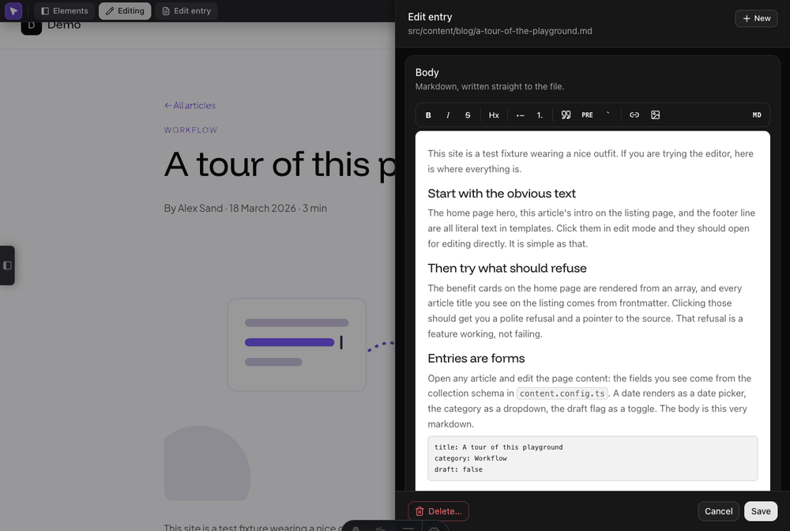
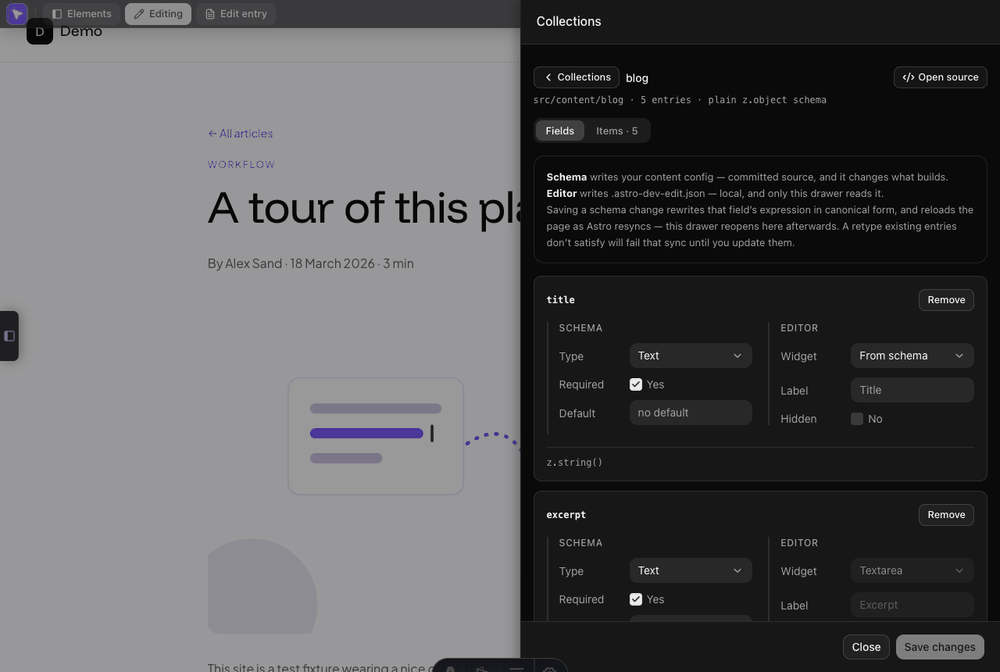

# Entry editor and collection designer

The CMS half of the tool: editing a content-collection entry as form fields,
and editing the collection's own schema. The [README](../README.md) covers
when you'd reach for these; this is the reference.

- [Entry editor](#entry-editor)
- [Setup per project](#setup-per-project)
- [Switching page editing on](#switching-page-editing-on)
- [Declaring the entry by hand](#declaring-the-entry-by-hand)
- [`image()` fields are relative to the entry file](#image-fields-are-relative-to-the-entry-file)
- [After a create or a delete](#after-a-create-or-a-delete)
- [Collections — the collection designer](#collections--the-collection-designer)

## Entry editor

On a detail page backed by a collection you have switched on, an **Edit entry**
button is always visible (no need to enter edit mode — it's a one-click CMS
action), and in edit mode clicking any collection-driven text offers **"Edit
page content"**. Both open a drawer that edits the entry like a CMS would:

**Frontmatter as typed form fields.** The field list, types, requiredness, defaults and enum options are **introspected from your own `content.config.ts` zod schema**, loaded through the dev server so it is always fresh.

| Schema | Control |
| --- | --- |
| `z.string()` | text |
| `z.coerce.date()`, `z.date()` | native date picker |
| `z.number()` | number |
| `z.boolean()` | checkbox |
| `z.enum` | select |
| `z.array(z.string())` | tags |

- Both zod majors are read — v3 on Astro 5/6, v4 on Astro 7, whose `astro/zod` re-exports `zod/v4`.
- **No schema resolvable?** Types are inferred from the entry's own values instead (a `YYYY-MM-DD` value infers as a date), so the panel always works.
- Every control is **named by the label above it**: clicking the label focuses the field and ticks a checkbox, and a screen reader reads the field's name with its help line, its error, and a checkbox's "not set" as the description. The same renderer draws the Settings drawer.

**Markdown body in a WYSIWYG editor.** A white writing surface under a sticky formatting toolbar.

- **Toolbar:** bold, italic, strikethrough, heading levels (H1–H6 dropdown), bulleted and numbered lists, quote, code block, inline code, links, and image insert — upload, browse existing assets, or type a path — with alt text auto-suggested from the file name.
- Clicking an image inside the body reopens the same panel to replace it.
- The **MD** button flips to raw-markdown source. Bodies using markdown the rich view cannot represent losslessly — tables, raw HTML or MDX, footnotes, nested lists, indented code — open in source mode, and the switch back to rich is refused rather than performed lossily.
- The body is rewritten only when you actually change it. Opening the drawer never reformats the file.

**Atomic, surgical saves.** One request writes everything at once.

- The YAML is patched in place: comments, key order, quoting and keys you did not touch survive byte-for-byte.
- Changed values are validated against your zod schema *before* the write, with inline per-field errors.
- Every write is etag-guarded. If the file changed on disk since the panel opened you get a conflict and a fresh reload, not a lost update.

**Create and delete.**

- **New** sits in the drawer's header. The slug is auto-suggested from the title and never overwrites an existing entry.
- **Delete** is confirmed. Undo is git.
- A field you leave alone is **left out of the file**, so your schema's default is what applies — including a boolean, whose unticked box means "not set" and says so, naming the default it will take.
- New entries take the collection's file extension: the per-collection `extension` config wins; otherwise, when every existing entry shares one extension the new entry follows it, and mixed or empty collections fall back to `.md`.




### Setup per project

1. Add the integration (above).
2. Switch page editing on for the collections you want to edit in place —
   admin bar → **Collections** (below). Nothing else.
3. Optional: tune fields via `entryEditor` config.

The file→collection mapping follows the `src/content/<name>/` convention.
Unconventional layouts and field tweaks go in the options:

```js
devEdit({
  entryEditor: {
    // configPath: 'src/content.config.ts',      // auto-detected normally
    collections: {
      blog: {
        // pageEditing: true,                    // normally set from the Collections drawer
        // dir: 'content/posts',                 // if not src/content/blog
        // extension: '.mdx',                    // for new entries; default: inferred (see below)
        fields: {
          excerpt: { widget: 'textarea' },
          image: { widget: 'image' },            // asset picker + upload
          internalId: { hidden: true },
        },
      },
    },
  },
})
```

Widgets: `text`, `textarea`, `date`, `number`, `boolean`, `select`, `tags`,
`image`, `json` (read-only). Fields whose zod shape the panel can't edit
(nested objects, unions) render read-only as `json` — including an `image()`
nested inside an object, which is a known gap.

### Switching page editing on

**Page editing is off for every collection until you switch it on.** Open the
admin bar's **Collections** drawer and each collection row carries a **Content
editor** switch. Turn one on and its detail pages get the entry drawer
immediately — no restart, no reload, and nothing added to your templates.

Under each collection's name the row shows the route it was matched to
(`/articles/[...slug]`), so you can see what turning the switch on will affect
before you do.

**How the entry is found.** Three things have to line up, and any of them
failing means no button rather than the wrong one:

1. The URL's route is **dynamic** — it renders one entry, not a list. A listing
   route like `/articles` has no single backing file and correctly gets nothing.
2. The page's own source names the collection, via `getCollection('blog')` or
   `getEntry('blog', …)`. This is what tells `/articles/…` apart from
   `/works/…` when both collections happen to hold a `hello-world.md`.
3. The URL's last segment matches an entry id in that collection — the file
   path under the collection directory, minus the extension, nested folders
   included.

If your route fetches entries through a helper, step 2 finds nothing and every
declared collection stays a candidate; a unique id still resolves, and a tie is
refused rather than guessed.

Where step 2 found nothing, the collection's own view says which of those two it
will be, rather than assuming the worst:

| What it says | What happens on a detail page |
| --- | --- |
| the entry is matched from the URL instead | the drawer works, with nothing to add to your templates |
| this collection has no entries yet | nothing to resolve to — add one and the drawer follows |
| another collection holds an entry of the same name | resolution refuses rather than guess, and the meta tag below is the answer |

Switching a collection **off** removes only the in-page drawer. The collection
stays in the Collections drawer, and its entries stay editable from the
**Items** tab, which is also how you reach a draft no rendered page links to.

Setting `pageEditing` in `astro.config.mjs` takes precedence and renders the
switch read-only with a padlock, the same way any config-set value does.

### Declaring the entry by hand

Emitting the meta tag **still works and still wins**, which is what it is for:
a data source the tool cannot walk, or a route it cannot match. Put one
**dev-only** tag in `<head>`:

```astro
---
import type { CollectionEntry } from 'astro:content';
const { entry } = Astro.props as { entry: CollectionEntry<'posts'> };
---
<head>
  {import.meta.env.DEV && (
    <meta
      name="astro-dev-edit:page-source"
      content={entry.filePath}
    />
  )}
</head>
```

Rules of the contract:

- **`content` must be the repo-relative path** to the file whose copy backs the
  page. For glob-loader content collections that's `entry.filePath`
  (e.g. `src/content/posts/my-post.mdx`). For other data sources, supply the
  equivalent path yourself.
- **Gate it on `import.meta.env.DEV`** so it never ships to production.
- **Emit it only on detail pages** — routes that render *one* entry. Archive /
  listing routes render a *set* of entries with no single backing file; leave
  the meta off and they correctly fall back to plain "Open source".
- The tag is checked before anything is resolved, so a page carrying one needs
  no collection switched on and behaves exactly as it did before this existed.
  If your layout renders inside a wrapper layout, make sure the meta ends up in
  the document `<head>` (e.g. via a named `head` slot).
- Entries must live under a configured `contentRoots` dir (default `src`).

The tool does **not** write this tag into your layout for you. Doing so would
mean guessing the entry variable's name, how your layouts wrap, and where the
document `<head>` lives — three guesses it takes nowhere else. A collection
that is switched on with no detected route offers the snippet with a **Copy**
button instead.

### `image()` fields are relative to the entry file

A field declared with Astro's `image()` helper doesn't hold a web URL — it holds
a path relative to the markdown file it sits in (`../../assets/blog/hero.png`),
which Astro imports at build time. The drawer detects these from your schema and
treats them accordingly:

- the **preview** resolves the relative value to the path the dev server serves,
  so it renders (a hint under the input names the file it's relative to)
- **Browse…** lists only the importable assets under `src/`, opening scoped to
  the field's own asset directory with a text filter and a "Show all" toggle
- **picking** writes the value back relative to the entry, never as a web path
- **uploads** land in the field's existing asset directory, falling back to
  `imageUploadDir` — which has to be under `src/`, because Astro *imports*
  these assets and `public/` files cannot be imported (a preflight warning
  fires if it isn't)

Animated GIFs are refused for these fields: Astro optimises `image()` assets,
which flattens the animation. Keep those in `public/` and reference them from a
plain `` instead.

Fields whose values genuinely *are* web paths — a plain `z.string()`, or any
field forced to the `image` widget via config — keep the original behaviour:
`public/` assets, web-shaped values. The two sets never mix. Full
`astro:assets` metadata (width/height/format) remains out of scope; the field
edits the path.

### After a create or a delete

After a create the browser navigates to the sibling URL (`/articles/<new-slug>`
by convention), polling it first until Astro's content layer has synced the
new file (up to ~10s) so you land on the rendered page, not a 404 — and that
wait survives the reload the sync itself causes, so the page you end up on is
the new entry either way; after a delete, to the parent listing. Projects with
non-conventional detail routes still get the file written/removed — only the
navigation guess differs.


## Collections — the collection designer

> **Experimental** — a badge on the drawer title says so. It writes committed
> source, its test coverage is thinner than the rest of the tool's, and it has
> known rough edges, so commit before you use it and read the diff to
> `src/content.config.ts` after a save. `schemaEditor: false` keeps it read-only.

**Collections** in the admin bar's overflow menu lists every collection your
content config declares, carries the [page-editing switch](#switching-page-editing-on)
for each, opens one into its field table, and can append a new one.
It is its own drawer, alongside Settings rather than inside it: an option is a
switch on this tool, while a collection's shape is your own committed source. It is
part of the [entry editor](#entry-editor)
surface, so `entryEditor: false` removes the menu item along with the drawer. Two
things it does that the rest of the overlay doesn't:

**It writes `src/content.config.ts`.** Adding a field, changing a field's type,
removing one, creating a collection — all of it patches that file, which is
committed TypeScript your build reads. The patch is surgical: only the touched
span changes, so comments, key order and quoting come out exactly as they went in.
Set `schemaEditor: false` to forbid this outright while keeping the rest of the
tool.

**Every field card holds two stores side by side, and says which is which:**

| Half | Controls | Written to | Effect |
| --- | --- | --- | --- |
| **Schema** | type, required, default, add, remove | `src/content.config.ts` | Committed. Changes what `astro build` accepts. |
| **Editor** | widget, label, hidden | `.astro-dev-edit.json` | Local, gitignored. Only the entry drawer reads it. |

A save that touches both does one request and tells you which half landed. A
widget or label your `astro.config.mjs` sets renders read-only with a padlock,
for the same reason a config-set option does.

Worth knowing before you use it:

-   **A schema save reloads the page.** Astro resyncs its content layer whenever
    that file changes. The drawer reopens itself in the collection you were
    editing.
-   **A retype your existing entries don't satisfy will fail that sync.** Change
    a field from text to number while entries hold strings and Astro refuses the
    collection until you update them — it names the first offending file. That is
    Astro's own validation doing its job, not a bug in the designer; the fix is to
    update the entries (or change the field back).
-   **Saving a schema change rewrites that field's expression in canonical form.**
    `z.string()`, `z.coerce.date()`, `z.enum([…])`, `z.array(z.string())`,
    `image()`, plus `.optional()` or `.default(…)`. If your field was written some
    other way that means the same thing, the canonical form replaces it.
-   **There is no rename.** A schema key is the frontmatter key in every entry
    file, so renaming it here alone would break the collection. Remove and add
    instead, and update the entries.
-   **Long text is a widget, not a schema type.** Set the schema type to *Text*
    and the widget to *Textarea* — the schema stays `z.string()` and the drawer
    renders the bigger control.
-   **Image fields are a switch, not a syntax.** Astro only hands a collection its
    `image()` helper when the schema is written as a function, so an **Image
    fields** switch sits above the field list on both a new collection and an
    existing one. It is what decides which form gets written:

    ```js
    // off
    schema: z.object({ … })
    // on
    schema: ({ image }) => z.object({ … })
    ```

    Turning it on stages the change like any other schema edit — **Save changes**
    writes it, and the *Type* list offers **Image** the moment you tick it, not
    after the save. Nothing between the braces moves either way. While it is off,
    *Image* is listed greyed, reading *turn on Image fields above*.

    Turning it back **off** is refused while any field still uses `image()`, and
    the refusal names them: remove or retype those fields first.
-   **A schema the designer can't prove, it won't touch.** Built by a helper,
    returned by a call, conditional — the row says so and offers *Open source*
    instead of controls.
-   **A spread is read around, not refused.** A schema that shares a block of
    fields between collections still opens:

    ```js
    schema: z.object({
      ...common,        // declared elsewhere
      author: z.string(),
    })
    ```

    `author` is editable like any other field, and a new field can be added.
    The fields `common` brings in are listed with their real types — Astro
    resolved them — but carry a **declared elsewhere** badge and read-only
    controls, because changing one means editing the module that declares it.
    A computed key (`[key]: z.string()`) is treated the same way. The one thing
    this refuses is turning **Image fields** back *off*, which it cannot do
    without proving nothing in the spread uses `image()`.
-   **Names are validated, not escaped.** A collection or field name has to be a
    plain identifier, and a new collection's directory is confined to
    `contentRoots` like any other write. A value that would need quoting to be
    written safely is refused rather than quoted, which keeps every expression
    the patcher writes a shape it can read back.



### Items

Each collection also has an **Items** view: its entry files, newest first, with a
badge on drafts. This is the way to reach an entry no rendered page links to — a
draft, or one whose route doesn't exist yet. Clicking an item opens the ordinary
entry drawer for it (this drawer hands over rather than stacking); **New
item** opens the ordinary create drawer, built from the collection's schema.
Deleting is still done from the entry drawer, still etag-guarded, and still has no
in-app undo.

