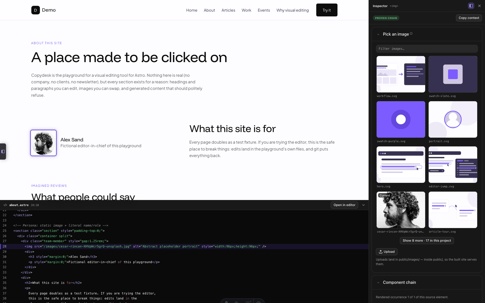
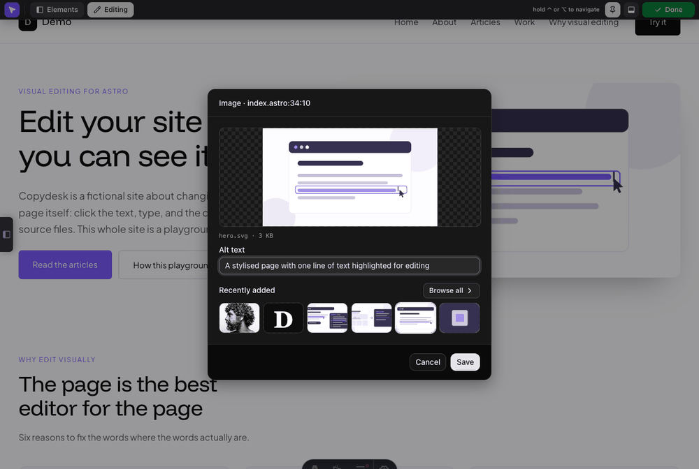
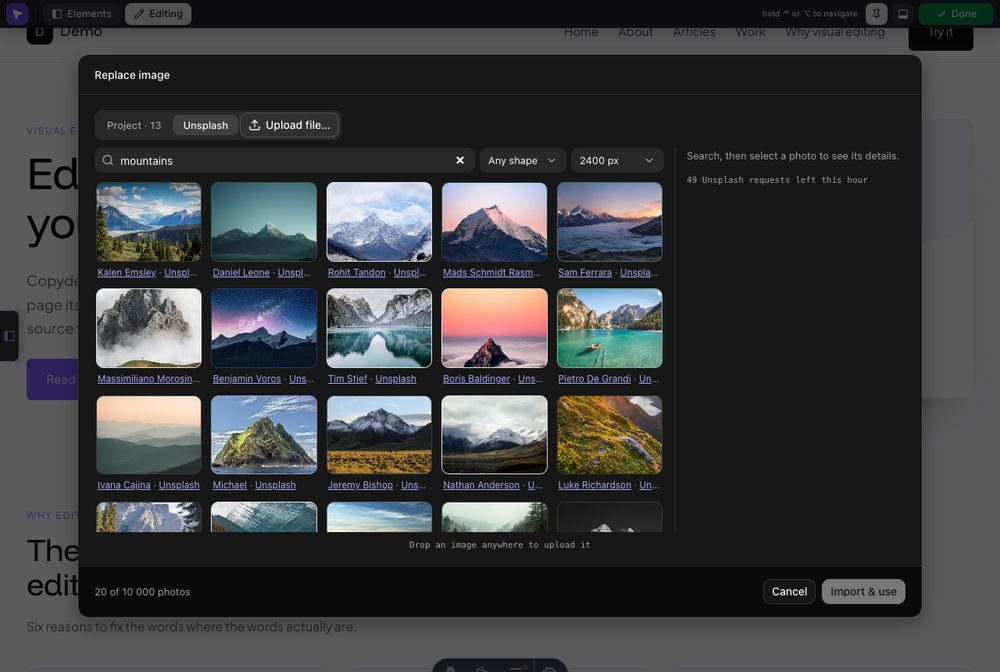

# Media picker and Unsplash

One picker serves every place you choose an image — the swap panel, the entry
drawer's `image()` fields, the rich body editor. Unsplash is an optional second
source inside it. The [README](../README.md) has the summary.

- [Media picker](#media-picker)
- [Unsplash photo picker](#unsplash-photo-picker)
- [Your access key](#your-access-key)
- [Import size](#import-size)
- [Attribution](#attribution)
- [Staying inside the rate limit](#staying-inside-the-rate-limit)

## Media picker

Anywhere you choose an image — the swap panel, the entry drawer's `image()`
fields, the rich body editor's image panel — the same picker opens: a grid of
your project's images, a filter, a folder scope toggle, and a details rail
showing the selected file's path, size and modified time.

Two things about how it behaves:

- **Newest first by default.** A file you uploaded a minute ago is the first
  thing you see, not something to hunt for alphabetically. Switch the sort to
  **Name** if you prefer.
- **Picking is staged, not applied.** Clicking a tile selects it; the footer's
  **Use image** is what hands it back to the field. **Cancel** or **Escape**
  writes nothing at all — which matters, because this modal can open on top of
  the entry drawer, and closing it must never disturb the fields underneath.
- **A file the field cannot take is shown, dimmed, with the reason.** `assetDirs`
  spans both `public/` and `src/assets`, because the two kinds of image field
  need opposite halves of it. An `image()` field needs a file Astro can import,
  which means under `src/`. A plain `` or a markdown `` needs a
  URL the **built** site has, which only your public directory gives —
  `/src/assets/hero.svg` is served in dev and absent from `dist/`. So the tile
  stays on screen and says which one it is rather than disappearing, and it
  cannot be selected. The rule is applied at pick time, where it is still cheap
  to choose something else.

Uploading works from the **Upload file…** button or by dropping a file anywhere
on the modal. Uploads land in `uploadDir` — or, for an `image()` field, beside
the field's existing asset. `uploadDir` has to be somewhere the browser can
fetch from, which means under your public directory (`public/`, unless your
Astro config sets `publicDir`): a file there becomes a plain ``, so a
`src/`-relative directory works in dev and 404s in a production build. A
preflight warning fires at startup if the configured directory isn't
web-servable.

The swap panel keeps a shortcut for the common case: a preview of the image you
are editing, and a strip of the **six most recently added** images, with
**Browse all** opening the full picker.





## Unsplash photo picker

Off by default. Turn it on with `unsplash: {}` and the picker grows a second
source: search Unsplash from inside the overlay, pick a photo, and the dev
server **downloads it into your project** like any other upload.

```js
devEdit({ unsplash: {} })
```

The photo is a normal file in your repo afterwards. Nothing but the local path
is written into your source, so your published site never depends on Unsplash
being up — and an `image()` field can use it, which a remote URL cannot.

Two things bound the feature:

- **A photo is importable only while the dev server that searched for it is
  running.** The server keeps the download URLs in memory rather than letting
  the browser supply them, so the browser can name a photo but cannot point the
  dev server at an arbitrary host. After a restart, an import answers "search
  again" instead.
- **A strict `img-src` CSP on your dev page blocks the thumbnails.** The grid
  stays usable — credits still read and photos still import — but the tiles
  show a placeholder.



### Your access key

Every user brings their own, from
[unsplash.com/oauth/applications](https://unsplash.com/oauth/applications). The
demo tier allows **50 API requests an hour** until Unsplash approves your
application for production (then 1000). Resolution order, highest first:

| Where | Notes |
| --- | --- |
| `unsplash.accessKey` in `astro.config.mjs` | An escape hatch for programmatic config, **not recommended**: that file is committed *and* is read by `astro build`, so the key travels with the repo. |
| An exported `UNSPLASH_ACCESS_KEY` | For CI. A shell variable overrides every `.env` file, so nothing in the project can replace it. |
| `UNSPLASH_ACCESS_KEY` in a `.env` file | Read through Vite's own env loader — note that `astro dev` does **not** copy `.env` into `process.env` itself. Among these files the later wins: `.env`, then `.env.local`, then `.env.development`, then `.env.development.local`. |
| The **Settings** drawer (admin bar → the purple mark → *Settings* → *Unsplash*) | The recommended path, and not a fourth place: it writes `UNSPLASH_ACCESS_KEY` into **`.env.local`** at your project root, `0600`. |

Because the drawer writes `.env.local`, it can replace a key you keep in `.env`
but not one in `.env.development`, `.env.development.local`, or your shell —
those outrank it. The panel says which file wins and disables its field rather
than accepting a value that would be ignored. A key in `.env` is the one
in-between case: saving over it works, **Clear** does not, since removing a line
from `.env.local` cannot unset one in `.env`.

A key stored by an older version, in `.astro-dev-edit.json`, still works. The
next time you save one the drawer moves it into `.env.local` and removes the old
copy; until then it says so.

**Gitignore `.env.local`.** The Settings panel names any file it writes that
your `.gitignore` does not cover — a plain `.env*` line covers it, as Astro's own
starters ship — but this integration cannot edit your ignore rules for you. The
key is never sent back to the browser: a read reports only whether one resolved,
from where, whether the panel may change it, and a masked fragment like
`••••••••Ab3d`.

### Import size

An imported photo is a file committed to your repo, so its width is worth
choosing rather than inheriting — a 480px card thumbnail never serves the extra
bytes of a 2400px JPEG. You set it in two places:

- **Project-wide** — `importWidth` in the config, or *Settings → Unsplash →
  Import width*. One of `800`, `1600`, `2400` (the default, so nothing changes
  unless you say so) or `'original'`.
- **Per import** — the size select in the Unsplash pane's toolbar, next to the
  shape filter. It starts at the project-wide value and applies to the next
  import only, because the right size belongs to the slot, not to the project.
  The details rail states what the pick will actually download.

Requests carry `fit=max`, so a width only ever **shrinks** a photo — asking for
2400px from a 1600px original gets you 1600px, and the rail says so.
`'original'` asks for the raw file at full resolution, bounded only by the
25 MB import cap. A width that is not one of the four is **refused**, not
rounded to the nearest one.

### Attribution

Handled for you, because the API guidelines require it: every photographer is
credited in the grid and in the details rail, linked to their profile with the
`utm_source`/`utm_medium` parameters attached **server-side** (so the client
cannot forget them), and each import pings Unsplash's download endpoint. Set
`appName` to the application name you registered, which is what `utm_source`
carries.

### Staying inside the rate limit

Searches are debounced, paging is a **Load more** button rather than infinite
scroll, and an identical search is served from a 5-minute server-side cache. Only
JSON calls count against the limit — the thumbnails in the grid are free — and
the requests you have left this hour are shown at the foot of the details rail.

